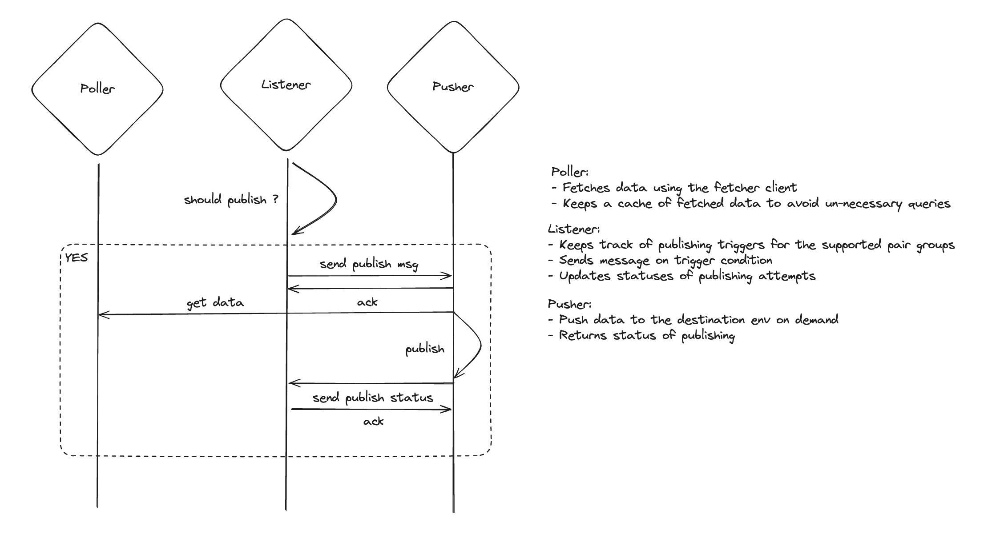

# Price pusher


## Usage

The price-pusher service is run through the ClI, to have more information you can use the `--help` command:

```bash
.venv ❯ python price_pusher/main.py --help

Usage: main.py [OPTIONS]
Options:

  -c, --config-file PATH          Path to YAML configuration file.  [required]

  --log-level [DEBUG|INFO|WARNING|ERROR|CRITICAL]
                                  Logging level.

  -n, --network [sepolia|mainnet]
                                  At which network the price corresponds.
                                  [required]

  -p, --private-key TEXT          Private key of the signer. Format:
                                  aws:secret_name,
                                  plain:private_key,
                                  env:ENV_VAR_NAME,
                                  or keystore:PATH/TO/THE/KEYSTORE:PASSWORD
                                  [required]

  --publisher-name TEXT           Your publisher name.  [required]

  --publisher-address TEXT        Your publisher address.  [required]

  --rpc-url TEXT                  RPC url used to interact with the chain.

  --max-fee INTEGER               Max fee used when using the onchain client.

  --pagination INTEGER            Number of elements per page returned from
                                  the onchain client.

  --enable-strk-fees BOOLEAN      Pay fees using STRK for on chain queries.

  --poller-refresh-interval INTEGER
                                  Interval in seconds between poller
                                  refreshes. Default to 5 seconds.

  --health-port INTEGER           Port for health check HTTP server. Default
                                  to 8080. Set to 0 to disable.

  --max-seconds-without-push INTEGER
                                  Readiness: maximum seconds without push
                                  before /ready reports not ready. Defaults
                                  to twice the longest time_difference of
                                  the config (at least 300 seconds).

  --max-seconds-without-poll INTEGER
                                  Liveness: maximum seconds without a
                                  completed poll round before /health
                                  reports unhealthy. Default to 300 seconds
                                  (5 minutes).

  --evm-rpc-url TEXT              Ethereum RPC URL used by on-chain fetchers
                                  (can be passed multiple times)

  --help                          Show this message and exit
```

For example, to push prices on mainnet with a plain private key:

```sh
uv run price_pusher \
  -c ./config/config.example.yaml \
  --log-level DEBUG \
  -n mainnet \
  -p plain:$PUBLISHER_PV_KEY \
  --publisher-name $PUBLISHER_NAME \
  --publisher-address $PUBLISHER_ADDRESS \
  --rpc-url https://starknet-mainnet.example/rpc/v0_10 \
  --evm-rpc-url https://my.ethereum.node
```

`--rpc-url` must be a Starknet **JSON-RPC 0.10** endpoint (`/rpc/v0_10`): since `pragma-sdk` 2.15 the pusher uses `pre_confirmed` and v3 transactions only, which 0.8 nodes reject, and 0.8 itself is deprecated on mainnet since Starknet 0.14.3. Without `--rpc-url` a public 0.10 endpoint from the SDK's fallback list is used.

### Docker

The published Docker image exposes the CLI directly. You can pass any option (including multiple `--evm-rpc-url` values) when starting the container:

```sh
docker run --rm \
  -v $(pwd)/config.yaml:/opt/price-pusher/config/config.yaml \
  ghcr.io/astraly-labs/price-pusher:latest \
  --config-file /opt/price-pusher/config/config.yaml \
  --network mainnet \
  --private-key plain:$PUBLISHER_PV_KEY \
  --publisher-name $PUBLISHER_NAME \
  --publisher-address $PUBLISHER_ADDRESS \
  --evm-rpc-url https://my.ethereum.node \
  --evm-rpc-url https://backup.rpc.example
```

If you omit `--evm-rpc-url`, the fetchers automatically fall back to the default public Ethereum RPC list bundled with the SDK.

### Health endpoints and Kubernetes probes

The health server binds port 8080 (`--health-port`) in the first seconds of the process, before the fetchers are built, and shuts down cleanly on `SIGTERM`.

- `/health` (also `/healthz`, `/`) is **liveness**: `200` while starting and as long as the poll loop completes rounds, `503` once no poll completed for `--max-seconds-without-poll`. It never depends on pushes: a publisher whose entries are fresh on-chain only pushes on deviation, and can legitimately go a long time without pushing.
- `/ready` is **readiness**: `503` until the first push and whenever the last push is older than `--max-seconds-without-push`.
- `/metrics` is the Prometheus exposition.

```yaml
livenessProbe:
  httpGet: { path: /health, port: 8080 }
  periodSeconds: 30
  failureThreshold: 5
readinessProbe:
  httpGet: { path: /ready, port: 8080 }
  periodSeconds: 30
terminationGracePeriodSeconds: 60
```

## Architecture



(Not 100% up to date and accurate with the latest changes, but the overall view is correct).
